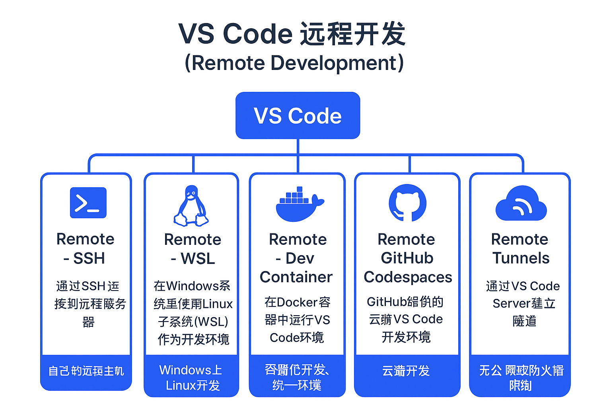

# VS Code 远程开发（Remote Development）教程

VS Code 的远程开发功能可以让你在本地 VS Code 操作远程环境，保持本地界面一致，但实际运行在远端或容器中。

## 1. Remote - SSH

**意思**：通过 SSH 连接到远程服务器，在远程机器上开发。  

**适用场景**：你有自己的 Linux 服务器或远程主机。

**使用方法**：
1. 安装 [Remote - SSH 扩展](https://marketplace.visualstudio.com/items?itemName=ms-vscode-remote.remote-ssh)
2. 点击左下角绿色图标 → **Remote-SSH: Connect to Host...**
3. 输入 SSH 地址（如 `user@ip`），配置密钥或密码
4. 成功连接后即可在远程服务器上编辑代码、运行终端

## 2. Remote - WSL

**意思**：在 Windows 系统里使用 Linux 子系统（WSL）作为开发环境。

**适用场景**：Windows 用户想用 Linux 工具链开发。

**使用方法**：
1. 安装 WSL（如 Ubuntu）
2. 安装 [Remote - WSL 扩展](https://marketplace.visualstudio.com/items?itemName=ms-vscode-remote.remote-wsl)
3. 点击左下角绿色图标 → **Remote-WSL: New Window**
4. 在 Linux 环境中开发，终端和工具都是 Linux

## 3. Remote - Dev Container

**意思**：在 Docker 容器中运行 VS Code 环境，容器里有完整工具链。

**适用场景**：项目依赖复杂，需要统一环境，便于多人协作。

**使用方法**：
1. 安装 Docker
2. 安装 [Remote - Containers 扩展](https://marketplace.visualstudio.com/items?itemName=ms-vscode-remote.remote-containers)
3. 项目中有 `.devcontainer` 文件夹 → 点击绿色图标 → **Remote-Containers: Reopen in Container**
4. VS Code 会构建容器并打开项目

## 4. Remote - GitHub Codespaces

**意思**：GitHub 提供的云端 VS Code 开发环境，可在浏览器或本地 VS Code 使用。

**适用场景**：不想搭建本地环境，直接用云端开发。

**使用方法**：
1. 需要 GitHub 支持 Codespaces 的账户
2. 打开 GitHub 仓库 → **Code → Codespaces → New codespace**
3. 在本地 VS Code 安装 [GitHub Codespaces 扩展](https://marketplace.visualstudio.com/items?itemName=GitHub.codespaces)
4. 打开 Codespace，即可远程开发

## 5. Remote - Tunnels

**意思**：通过 VS Code Server 建立隧道，让你在本地访问防火墙或 NAT 后的远程机器。

**适用场景**：远程机器没有公网 IP 或无法直接 SSH。

**使用方法**：
1. 安装 [Remote - Tunnels 扩展](https://marketplace.visualstudio.com/items?itemName=ms-vscode-remote.remote-tunnels)
2. 在远程机器启动 VS Code Server
3. 本地 VS Code 连接 Tunnel，即可远程开发

## 对比表

| 类型              | 依赖           | 场景                  | 优点                   | 缺点              |
| ----------------- | -------------- | --------------------- | ---------------------- | ----------------- |
| SSH               | 远程服务器     | 自己的远程主机        | 快速、直接操作         | 需公网或 VPN      |
| WSL               | Windows + WSL  | Windows 上 Linux 开发 | 无需远程、Linux 工具链 | 仅限 Windows      |
| Dev Container     | Docker         | 容器化开发、统一环境  | 环境可复现             | 需安装 Docker     |
| GitHub Codespaces | GitHub         | 云端开发              | 随时随地，环境一致     | 需账户或付费      |
| Tunnel            | VS Code Server | 无公网或防火墙限制    | 不需 SSH 或公网        | 依赖 VS Code 服务 |

> ✅ 小技巧：
> - 所有远程开发方式，都可以像本地一样调试和运行代码  
> - 如果环境复杂或多人协作，推荐 Dev Container 或 Codespaces
