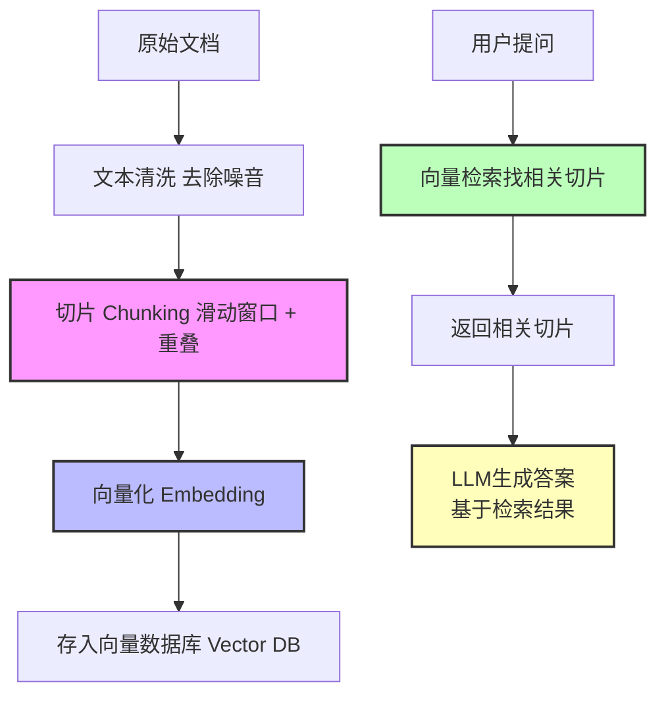
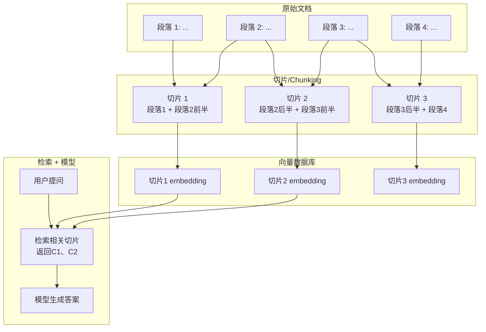

# **RAG（检索增强生成）简介与工作流程**

在大模型应用中，我们常常遇到这样的问题：模型知识有限，无法回答最新或专业领域的问题。**RAG（Retrieval-Augmented Generation）** 就是为了解决这个问题而提出的。它结合 **知识库检索** 和 **生成模型**，实现“查资料 + 生成答案”的模式。

---

## **1. 知识库切片（Chunking）**

知识库通常是长文档，而大模型处理文本长度有限。因此，我们要将文档拆成小块，这个过程叫 **切片（chunking）**。

**切片规则：**

* **chunk\_size**：每块最大长度（字符数或 token 数）
* **chunk\_overlap**：相邻块的重叠长度，保证上下文连续
* **策略**：按段落/句子分块 + 滑动窗口

**为什么要切片？**

* 避免超出模型上下文长度
* 提高检索精度
* 保留语义连续性，减少信息丢失

---

## **2. 向量化与存储**

切片后，我们需要把文本转成 **向量（embedding）**，存入 **向量数据库（Vector DB）**，方便快速检索。

**流程：**

1. 每个切片生成 embedding
2. 存入向量数据库
3. 后续可根据相似度快速找出相关切片

---

## **3. 用户提问与检索**

当用户提出问题时：

1. 模型先把问题转成向量
2. 在向量数据库中检索最相关的切片
3. 返回给生成模型

这样，模型就能在最新、专业的知识范围内生成答案，而不仅依赖自身训练的固有知识。

---

## **4. 模型生成答案**

最后，LLM（大语言模型）根据 **检索到的切片** 生成回答：

* 保留文档原有信息
* 可回答最新或专业问题
* 提高准确性与可靠性

---

## **5. 精简流程图**

---

## **6. 文档 + 切片 + 检索 +模型生成答案 的整体可视化示意图** 

### **总结**

* **切片**：把文档拆成小块，便于检索
* **向量化**：让文本可以被快速匹配
* **检索**：找到最相关的文档片段
* **生成模型**：结合检索结果生成准确答案

RAG 的核心理念就是 **“先找资料，再回答问题”**，既发挥模型生成能力，又解决知识更新和专业性问题。
